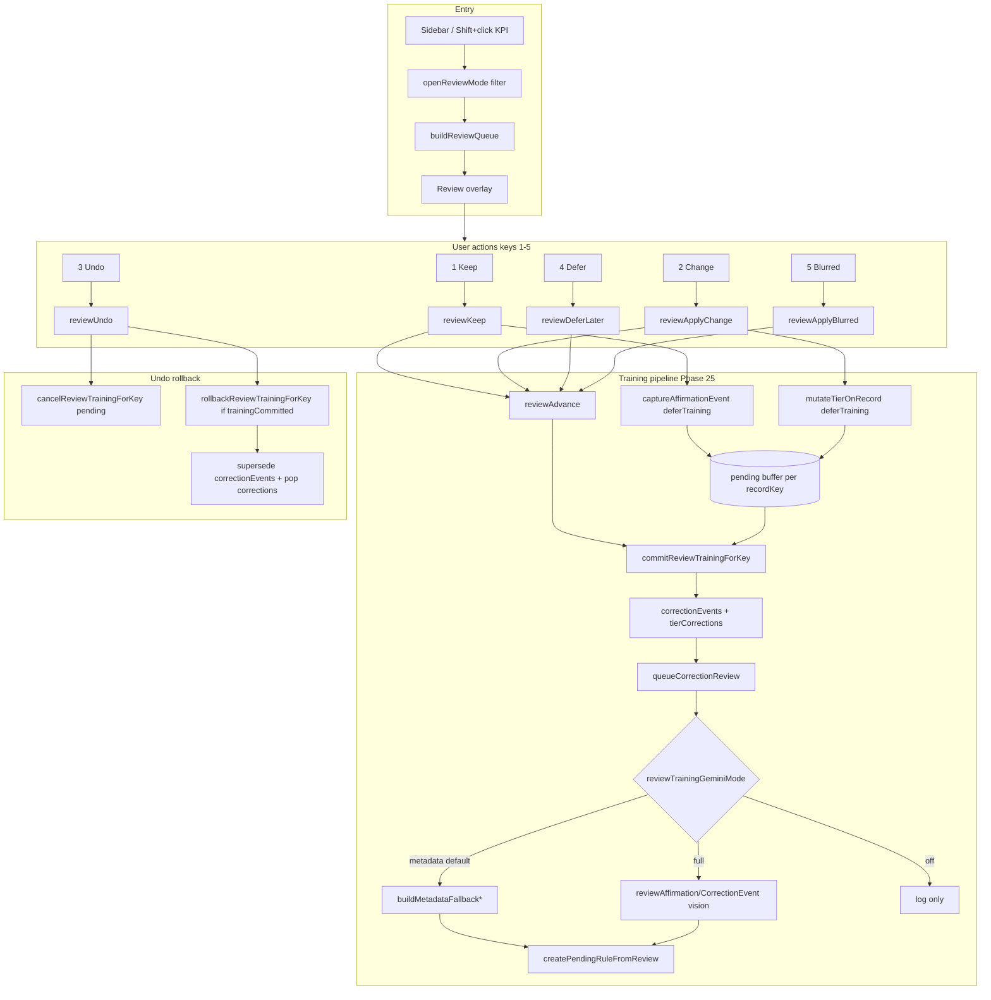

# Review Process Audit — Property Distress Analyzer

**Audited:** 2026-06-30  
**Scope:** Full human review loop (UI → training → brain → future scans)  
**Method:** GSD phase research + code trace + test verification

---

## Executive summary

| Priority | Item | Status |
|----------|------|--------|
| **A** | Deferred training commit (log on advance, not click) | ✅ Phase 25 shipped |
| **B** | Undo rollback (pending + committed artifacts) | ✅ Phase 25 shipped |
| **C** | Cheaper Gemini (`metadata` default, affirmation path) | ✅ Phase 25 shipped |

**Most important right now:** Run formal GSD milestone audit (v1.6), Nyquist validation (phase 25), and integration tests for Keep → Undo → Change — not re-implementing A/B/C.

**Tests:** 129/129 passing (`npm test`)

---

## Review flow map



---

## Files by responsibility

| Layer | Files | Role |
|-------|-------|------|
| UI / overlay | `public/js/imagery.js`, `public/index.html`, `public/css/cyber-review.css` | Review overlay, advance, undo, open/close |
| Queue / filters | `public/js/review.js`, `public/js/session.js` | `buildReviewQueue`, `getFilteredResults`, progress persistence |
| Training | `public/js/scan.js`, `lib/review-training.js` | defer/commit/rollback, Gemini queue, learned rules |
| State | `public/js/state.js`, `public/js/config.js` | `reviewedKeysByFilter`, session hydrate, `reviewTrainingGeminiMode` |
| Persistence | `persistence.js`, `lib/backups.js` | review-progress, review-undo, review-exit saves |

---

## Review modes (filters)

| Filter | Queue source | Keep trains? | Change trains? |
|--------|--------------|--------------|----------------|
| `distressed` | Tier = distressed property | ✅ affirmation | ✅ tier correction |
| `well_maintained` | Tier = well maintained | ✅ affirmation | ✅ tier correction |
| `vacant` | Vacant lot / land | ❌ land keep | category → property |
| `review` | needsReview / needsReviewLater | ❌ stats only | → home + tier picker |
| `low_confidence` | classificationConfidence &lt; 65 | ✅ affirmation | ✅ tier correction |

---

## Phase 25 fixes (the “all three”)

### A — Deferred commit
- `deferTraining: true` on Keep/Change in review mode
- `reviewAdvance` → `commitReviewTrainingForKey` (not on button click)
- Pending buffer: one action per `recordKey` (last wins)

### B — Undo rollback
- `reviewUndo` → `cancelReviewTrainingForKey` (pending)
- If `trainingCommitted` on undo stack item → `rollbackReviewTrainingForKey`
- Rolls back `correctionEvents` (superseded), `tierCorrections`, `scoreCorrections`

### C — Cheaper Gemini + affirmation
- `state.reviewTrainingGeminiMode` default: `'metadata'` (no vision API)
- `'full'` → photo-based `reviewAffirmationEvent` / `reviewCorrectionEvent`
- `'off'` → record only, no rule proposal
- Affirmations use dedicated prompt path (was dead code pre-25)
- Dedupe: one Gemini job per `recordKey` + action type per session

---

## Remaining gaps (post Phase 25)

| ID | Severity | Gap | GSD fix |
|----|----------|-----|---------|
| GAP-01 | Medium | No integration test for Keep → Undo → Change training chain | Phase 26 plan 01 |
| GAP-02 | Medium | Phases 21–25 lack `*-VALIDATION.md` (Nyquist) | `/gsd:validate-phase 25` (and 21–24) |
| GAP-03 | Low | `REQUIREMENTS.md` missing REV-01–04 traceability | Phase 26 docs sync |
| GAP-04 | Low | `PROJECT.md` still references v1.5 active | Phase 26 docs sync |
| GAP-05 | Low | Category/blurred review paths still immediate training (not deferred) | Optional Phase 27 |
| GAP-06 | Low | No Playwright E2E for review overlay | Optional Phase 27 |
| GAP-07 | Info | `gsd-tools init milestone-op` reports v1.2 (stale vs ROADMAP v1.6) | Update GSD milestone metadata |

---

## GSD command playbook (audit → enhance)

Run in order from `Projects/property-distress-analyzer`:

```bash
# 1. Refresh codebase map (review subsystem)
/gsd:map-codebase review

# 2. Audit v1.6 milestone (aggregates phase VERIFICATION.md files)
/gsd:audit-milestone v1.6

# 3. Nyquist validation for review phase
/gsd:validate-phase 25

# 4. If audit finds gaps → auto-group fix phases
/gsd:plan-milestone-gaps

# 5. Plan + execute hardening phase
/gsd:plan-phase 26
/gsd:execute-phase 26

# 6. Close milestone when audit passes
/gsd:complete-milestone v1.6

# 7. Manual smoke (after deploy)
# - Open distressed review → Keep → Undo → Change → verify one correctionEvent
# - Console: state.reviewTrainingGeminiMode → 'metadata' (no vision calls)
# - Set 'full' → Keep → verify affirmation log mentions photos
```

---

## Manual smoke checklist

- [ ] Distressed review: Keep logs “brain training signal queued”, advances, one event after advance
- [ ] Undo restores record + removes committed training (`trainingCommitted` path)
- [ ] Change after Undo produces single new event (no duplicates)
- [ ] `reviewTrainingGeminiMode: 'metadata'` — no `callGeminiVision` in network tab on Keep
- [ ] Low confidence filter resumes progress after refresh
- [ ] Exit review → re-open skips reviewed keys

---

## Cost / learning cheat sheet

| Action | Property record changes | Training logged | Gemini call (default) |
|--------|-------------------------|-----------------|------------------------|
| Keep (distressed/well_maintained) | mark reviewed | on **advance** — affirmation | metadata fallback only |
| Change tier | tier + score update | on **advance** — correction | metadata fallback only |
| Undo | restore snapshot | rollback committed | none |
| Defer | needsReviewLater flag | none | none |
| Blurred | category → blurred | immediate category correction | may queue (not deferred) |

Set `state.reviewTrainingGeminiMode = 'full'` in browser console when you want photo-based rule training.